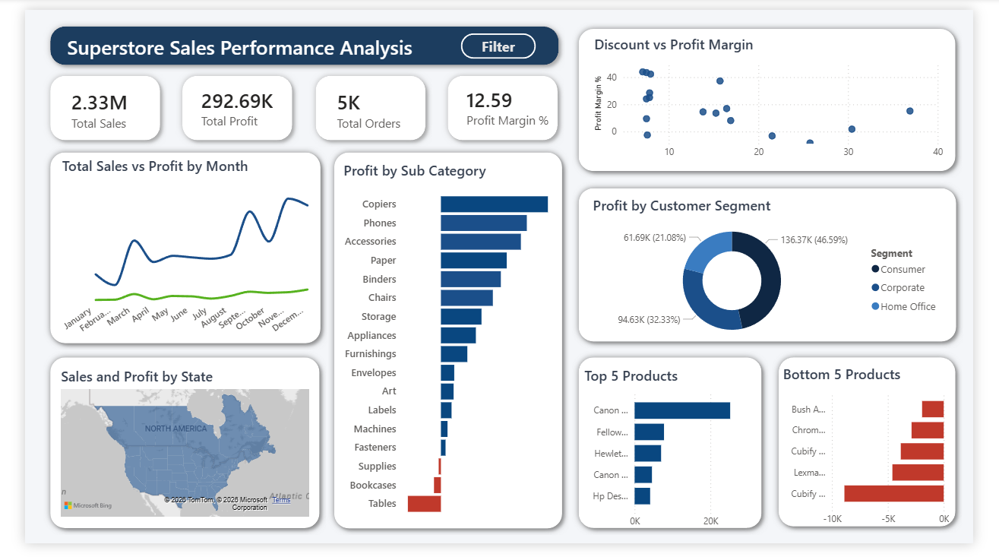

# E-Commerce Sales Performance Analysis

**Tools:** SQL Server · Excel · Power BI · CRISP-DM  
**Author:** Prachi Upadhyay  
**Date:** April 2026

---

## Business Problem

The company generates $2.3M in annual sales but lacks clarity on 
profitability drivers. Key concerns:
- Certain product categories generating consistent losses
- High discounts reducing overall profitability
- Revenue growth not translating into profit growth

---

## Methodology — CRISP-DM

| Phase | What Was Done |
|---|---|
| Business Understanding | Defined 5 analytical questions tied to profit, discounting, and regional performance |
| Data Understanding | Explored 10,194 rows across 21 columns |
| Data Preparation | Removed duplicates, standardised text, validated dates, engineered Profit Margin |
| Analysis | Executed 12 SQL queries across category, product, region, and segment dimensions |
| Evaluation | Validated all 5 questions were answered, extracted 4 key insights |
| Deployment | Built interactive Power BI dashboard with DAX measures and slicers |

---

## Key Findings

- **Furniture loses money** — Tables sub-category: -$17,753 loss on $208K in sales (25.8% avg discount)
- **Discounting is destroying margin** — Orders with 40%+ discount generated -$100,030 in losses
- **Technology leads profitability** — Copiers deliver 37% profit margin vs Furniture's 2.6%
- **Central region underperforms** — 7.9% margin vs West's 15% despite $503K in sales

---

## Dashboard Preview



---

## Project Structure

```
ecommerce-sales-analysis/
│
├── data/
│   └── samplesuperstore.csv
│
├── sql/
│   └── SQLQuery2.sql
│
├── dashboard/
│   ├── sample_super_store.pbix
│   └── dashboard_preview.png
│
├── presentation/
│   └── Superstore_Analysis_Prachi_Upadhyay.pdf
```

---

## Recommendations

1. Cap discounts at 20% — estimated recovery of $50K–$80K annually
2. Shift investment toward Technology (Copiers, Phones, Accessories)
3. Investigate Central region pricing and discount policy
